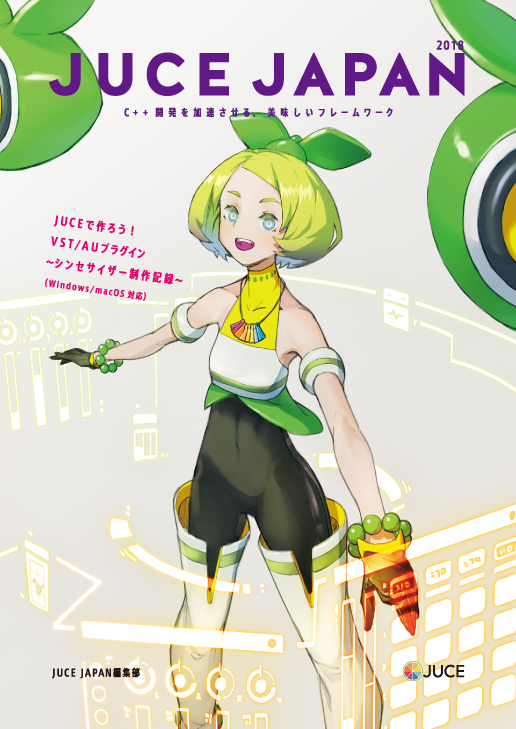

# JUCE JAPAN 2018

[Amazon Kindle Store](https://www.amazon.co.jp/dp/B07HQHFKX9)

## 動作確認環境

Visual Studio: 2017, 2019

JUCE: [JUCE v5.4.3](https://github.com/WeAreROLI/JUCE/tree/5.4.3)

## サンプルプロジェクト

#### HelloSineWave

正弦波を再生する実装例です

#### OneShotSampler

ワンショットサンプラーの実装例です

#### SimpleSynth

シンプルなモジュールで構成されたVAシンセサイザーの実装例です

## License
GPL v3