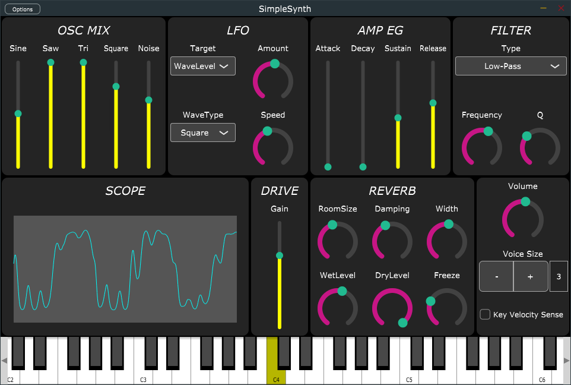

# SimpleSynth

This is a example of Virtual Analog Synthesiser that implemented as minimum changes.

This project is created with "Audio Plugin" template from Projucer.

# require 

This project is depends on JUCE.
https://github.com/WeAreROLI/JUCE