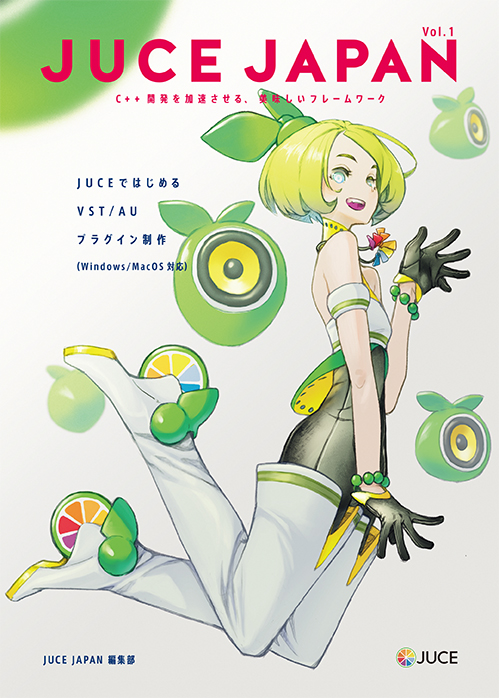

# JUCE JAPAN vol.1

[Amazon Kindle Store](https://www.amazon.co.jp/dp/B01HSEBPKO)

## 動作確認環境

Visual Studio: 2015, 2017

JUCE: [JUCE v5.2.0](https://github.com/WeAreROLI/JUCE/tree/5.2.0)

## サンプルプロジェクト

### JUCE JAPAN DEMO

JUCE JAPAN vol.1で掲載している歪みエフェクター（ディストーション）の実装例です。

## License
GPL v3