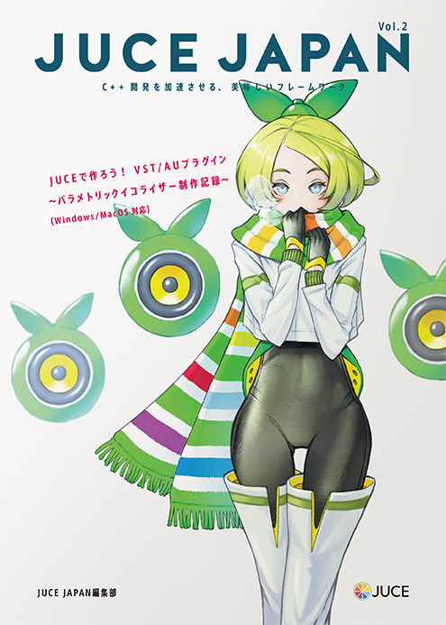

# JUCE JAPAN vol.2

[Amazon Kindle Store](https://www.amazon.co.jp/dp/B01MQFZ2CX)

## 動作確認環境

Visual Studio: 2015, 2017

JUCE: [JUCE v5.2.0](https://github.com/WeAreROLI/JUCE/tree/5.2.0)

## サンプルプロジェクト

### SimpleEqualizer

JUCE JAPAN vol.2で掲載しているパラメトリックイコライザーの実装例です。

## License
GPL v3